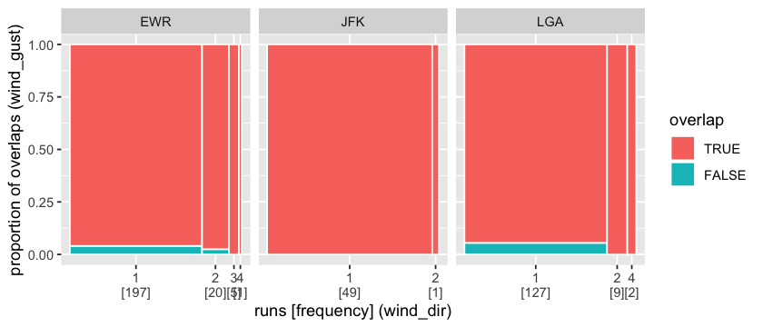

<!-- README.md is generated from README.Rmd. Please edit that file -->

# mists

<!-- badges: start -->

[](https://travis-ci.org/earowang/mists)
[](https://codecov.io/gh/earowang/mists?branch=master)
[](https://cran.r-project.org/package=mists)
[](https://www.tidyverse.org/lifecycle/#experimental)
<!-- badges: end -->

The **mists** package provides a suite of 1d, 2d, and visual tools for
exploring and polishing missing values residing in temporal data. The
primary focus of temporal missings is to look at the runs of `NA`, and
the association with other variables.

## Installation

Install the development version from [GitHub](https://github.com/) with:

``` r
# install.packages("remotes")
remotes::install_github("earowang/mists")
```

## Get started with `na_rle()` and `list_of_na_rle()`

The `na_rle()` gives a sparser representation for runs of missings, a
special type of run length encoding (`rle`).

``` r
library(mists)
(x <- na_rle(c(1, NA, NA, 4:7, NA, NA, 10:15, NA)))
#> <Run Length Encoding <NA>[3]>
#> $lengths: <int> 2 2 1 
#> $values : <int>  2  8 16
(y <- na_rle(c(10, NA, NA, NA, 6:3, NA, 1)))
#> <Run Length Encoding <NA>[2]>
#> $lengths: <int> 3 1 
#> $values : <int> 2 9
```

It returns a named list of `lengths` and `values` (the starting indices)
of `NA` runs. Set operations can be applied: (1) `intersect(x, y)`, (2)
`union(x, y)`, (3) `setdiff(x, y)`.

The `list_of_na_rle()` makes it easier to work with tibbles.

``` r
library(dplyr)
na_runs_wind <- nycflights13::weather %>% 
  group_by(origin) %>% 
  summarise_at(vars(contains("wind")), ~ list_of_na_rle(., time_hour))
na_runs_wind
#> # A tibble: 3 x 4
#>   origin        wind_dir      wind_speed       wind_gust
#>   <chr>  <list<rle<NA>>> <list<rle<NA>>> <list<rle<NA>>>
#> 1 EWR              [223]             [1]           [644]
#> 2 JFK               [50]             [3]           [519]
#> 3 LGA              [138]             [0]           [670]
```

## Range plots and extended spinoplots

How are those missings distributed and associated with
others?

``` r
autoplot(na_runs_wind$wind_dir, na_runs_wind$origin, shape = 4)
```


``` r
na_rle_spinoplot(na_runs_wind$wind_dir[[1]], na_runs_wind$wind_gust[[1]])
```



## Data polishing

Data polishing isn’t data cleaning.

## Related work

  - [imputeTS](http://steffenmoritz.github.io/imputeTS/): Time Series
    Missing Value Imputation
  - [VIM](https://github.com/statistikat/VIM): Visualization and
    Imputation of Missing Values
  - [naniar](http://naniar.njtierney.com): Data Structures, Summaries,
    and Visualisations for Missing Data
