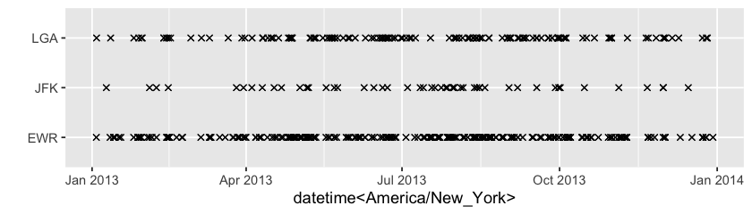

<!-- README.md is generated from README.Rmd. Please edit that file -->

# mists

<!-- badges: start -->

[](https://travis-ci.org/earowang/mists)
[](https://codecov.io/gh/earowang/mists?branch=master)
[](https://cran.r-project.org/package=mists)
[](https://www.tidyverse.org/lifecycle/#experimental)
<!-- badges: end -->

The **mists** package provides a suite of 1d, 2d, and visual tools for
exploring and polishing missing values residing in temporal data. The
primary focus of the package is to look at the runs of `NA` and the
association with other variables, and to formulate missing data
polishing strategies.

## Installation

Install the development version from [GitHub](https://github.com/) with:

``` r
# install.packages("remotes")
remotes::install_github("earowang/mists")
```

## Get started with `na_rle()` and `list_of_na_rle()`

The `na_rle()` gives a sparse representation for indexing runs of
missings, a special type of run length encoding (`rle`).

``` r
library(mists)
(x <- na_rle(c(1, NA, NA, 4:7, NA, NA, 10:15, NA)))
#> <Run Length Encoding <NA>[3]>
#> $lengths: <int> 2 2 1 
#> $indices: <int>  2  8 16
(y <- na_rle(c(10, NA, NA, NA, 6:3, NA, 1)))
#> <Run Length Encoding <NA>[2]>
#> $lengths: <int> 3 1 
#> $indices: <int> 2 9
```

It returns a named list of `lengths` and `indices` (the starting
indices) of `NA` runs. Set operations can be applied: `intersect(x, y)`,
`union(x, y)`, and `setdiff(x, y)`, along with other math operations.

The `list_of_na_rle()` makes it easier to work with tibbles.

``` r
library(dplyr)
na_runs_wind <- nycflights13::weather %>% 
  group_by(origin) %>% 
  summarise_at(
    vars(contains("wind")), 
    ~ list_of_na_rle(., index_by = time_hour)
  )
na_runs_wind
#> # A tibble: 3 x 4
#>   origin        wind_dir      wind_speed       wind_gust
#>   <chr>  <list<rle<NA>>> <list<rle<NA>>> <list<rle<NA>>>
#> 1 EWR              [223]             [1]           [644]
#> 2 JFK               [50]             [3]           [519]
#> 3 LGA              [138]             [0]           [670]
```

## Range plots and extended spinoplots

How do those missings distribute and associate with others? The range
plot below shows many of single `NA` runs occurs to `wind_dir` in 2013.

``` r
na_runs_wind %>% 
  na_rle_rangeplot(x = wind_dir, y = origin, shape = 4)
```



The spinoplot has been extended to examine the association of missing
runs with a second variable through temporal overlapping. A large amount
of missings in `wind_dir` intersects with `wind_gust` missings at all
three places.

``` r
na_runs_wind %>% 
  na_rle_spinoplot(x = wind_dir, y = wind_gust, facets = origin)
```


## Missing data polishing

Too many missings spread across variables and observations like the
`wdi` dataset (world development indicators)? Every observation and
measured variable contains `NA`, and almost half of the data goes
missing. We would end up with no data if using listwise deletion.

    #> # A tibble: 1 x 5
    #>   prop_overall_na prop_cols_na prop_rows_na data_ncols data_nrows
    #>             <dbl>        <dbl>        <dbl>      <int>      <int>
    #> 1           0.449            1            1         57      10850

Polishing columns and rows iteratively sweeps out chunks of `NA` but
leaves some of them in. The index should be kept intact by slicing the
ends only due to the temporal ordering. The `na_polish_auto()` automates
this polishing process by minimising the loss, defined as *the
proportion of overall missings* weighted by *the proportion of removed
observations*. It will iterate the following passes:
`na_polish_measures()`, `na_polish_key()`, `na_polish_index()` until a
tolerance value (close or equal to zero). The `na_polish_*()` family
expects a [tsibble](http://tsibble.tidyverts.org), because polishing
starts with tidy and clean data.

``` r
wdi_ts <- wdi %>% 
  tsibble::as_tsibble(key = country_code, index = year)
wdi_after <- na_polish_auto(wdi_ts, cutoff = .8, quiet = TRUE)
na_polish_metrics(wdi_ts, wdi_after)
#> # A tibble: 1 x 6
#>   prop_na nobs_na prop_removed nobs_removed nrows_removed ncols_removed
#>     <dbl>   <int>        <dbl>        <int>         <int>         <int>
#> 1   0.636  220533        0.581       346948          5752             6
```

## Related work

  - [imputeTS](http://steffenmoritz.github.io/imputeTS/): Time Series
    Missing Value Imputation
  - [VIM](https://github.com/statistikat/VIM): Visualization and
    Imputation of Missing Values
  - [naniar](http://naniar.njtierney.com): Data Structures, Summaries,
    and Visualisations for Missing Data
