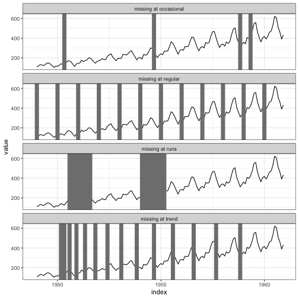
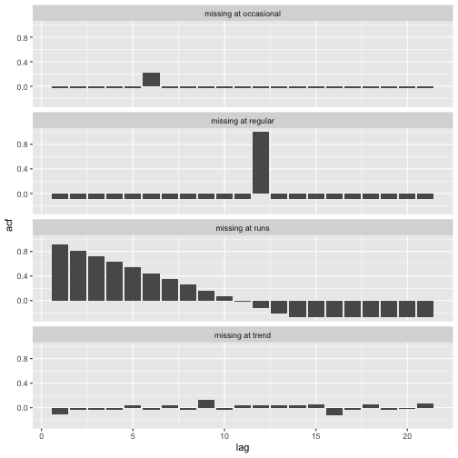
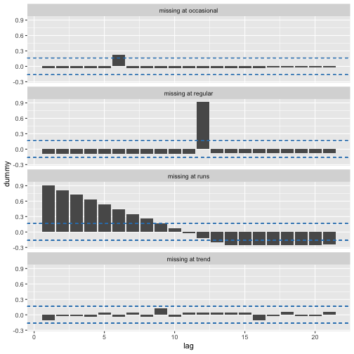
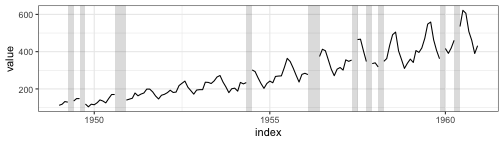
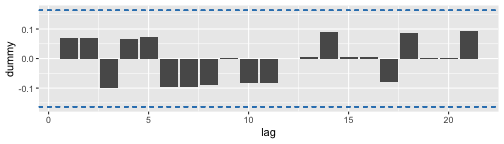

## Abstract

Can missing values methods speak the language of data, to go beyond the probabilistic taxonomy, MCAR, MAR, MNAR? Yes they can! The **naniar** package provides a suite of exploratory methods and imputation choices for tidy missing data analysis, that fit neatly into a tidy data workflow. However, temporal data is left behind. This talk will present exploratory methods for temporal missing, equipped with a new data-centric taxonomy. The work will be available in the R package called **mists**.


```
#> Error in library(feasts): there is no package called 'feasts'
```

## Types of temporal missingness

From the decomposition point of view, missingness can be classified into four categories (I feel these categories are not accurate, we can come up with something better):

1. **missing at occasional**: probably "missing at random" is a better alternative, but is messed up with MAR. "missing at random time"? "occasional" merely tells a small proportion of the series is missing. But "missing at random time" can take a `prop` argument to determine what proportion can be missing. short memory, constrast to "missing at runs". (MCAR)
2. **missing at season**: missing at a particular season. Do they all have to missing, how about parts of missing at seasons? Missing at every months? missing at every 3 years? (MAR, some time explanatory response like trend)
3. **missing at runs**: missing at run length (blocks)? but displaying sticky. (missing with auto correlation, unique to time series, NOT MAR bc no driving variable; maybe MCAR?)
4. **missing at trend**: missing at increasing/decreasing rate. (functional form, MAR, related to measured variable)
5. related to level of series (missing at random, explained by the level)

Ultimately, missing at mix.



How do they display on ACF plots? (better using binary CF)



How do they display on decomposition plots? 

probably not accurate, bc may not satisfy the assumption

(logistic gam, decomposition is essentially a gam)

binary = f(response)


```
#> Error in STL(., dummy): could not find function "STL"
```

```
#> Error in STL(., dummy): could not find function "STL"
```

```
#> Error in STL(., dummy): could not find function "STL"
```

```
#> Error in STL(., dummy): could not find function "STL"
```

```
#> Error in eval(expr, envir, enclos): object 'p1' not found
```

## Example: airline passengers






```
#> Error in STL(., dummy): could not find function "STL"
```

## What next?

1. clean up the taxonomy for temporal missings
2. run logistic decomposition
3. combine multiple time series
4. ticks on y corresponding to x
